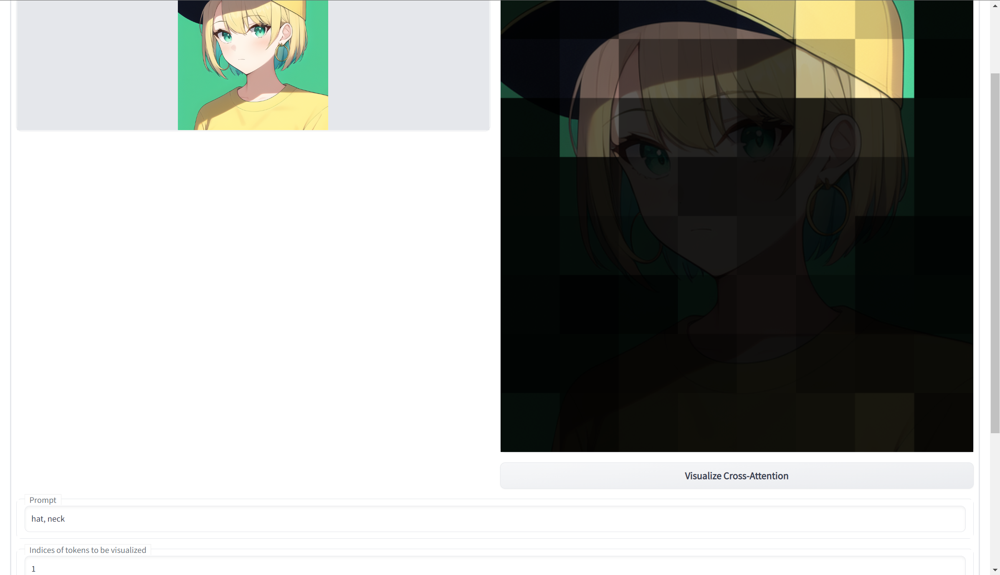
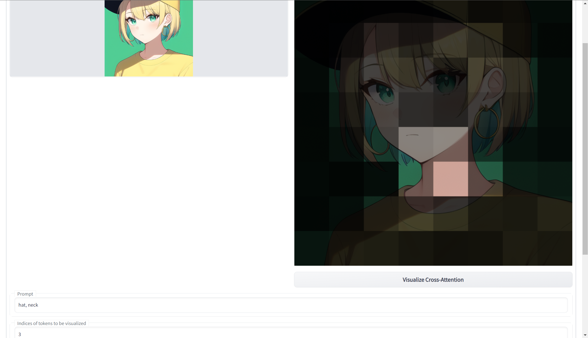
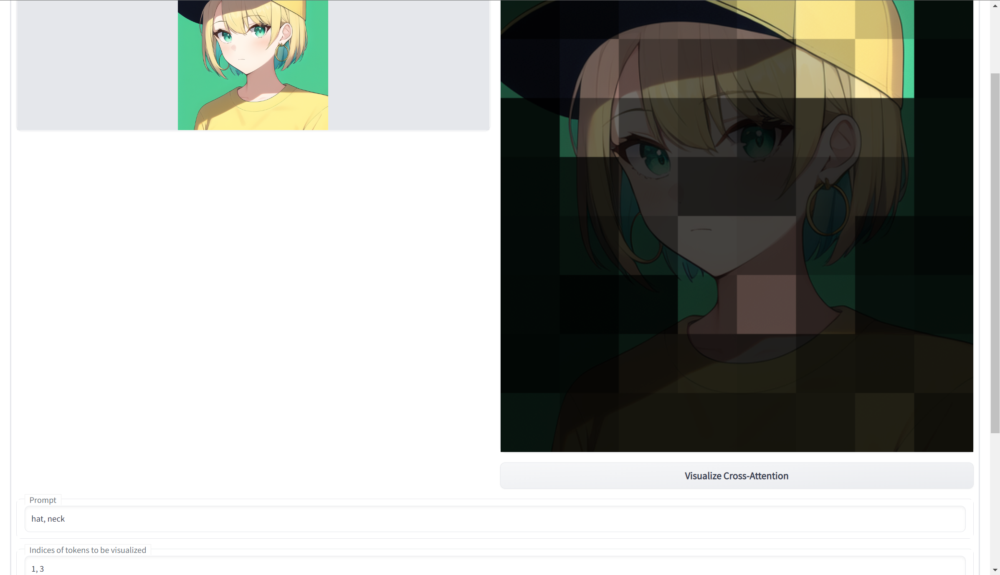

# Visualize Cross-Attention

The process of image generation in the stable diffusion model involves comparison between the encoded image (latent) and the encoded words (embedding). The comparison is performed "pixel-wise" on the encoded image. The more related the encoded "pixel" and the encoded word are, the more effect from the word will be applied on the "pixel". This is known as cross-attention, and the strength of the cross-attention can be seem as the strength of the relevance. The image decoder in stable diffusion has a CNN structure, which means it maps adjacent encoded "pixels" to adjacent real pixels. This makes it easy to visualize the cross-attention stength in the encoded space on the decoded image. This extension provides such a visualization.

# Usage

Put the `scripts` folder in `stable-diffusion-webui/extensions/VisualizeCrossAttention/`, and restart the webui. A new tab `VXA` should be added to the webui.

A visualization can be generated by the following steps:
- Drop a image (height and width shoule be multiple of 256) on the left of the ui.
- Enter the prompt that we want to visualize in the prompt box, for example, `hat, neck`.
- A word will be first encoded to one or more tokens before input into the diffusion model. For example, in textual inversion, we can choose the number of tokens of a specific tag. For a preview of the tokenize result, we can use the [tokenizer extension](https://github.com/AUTOMATIC1111/stable-diffusion-webui-tokenizer). Usually, one simple word will be encoded to one token, and note that a comma will also be encoded to a token. 
- In the `indices of token` box, we should enter the specific token that we want to visualize. For instance, `1, 3` means the first and the third tokens. In the above example, it corresponds to `hat` and `neck`. The `neck` prompt is on the third because the comma "`,`" in the prompt is the second token. 
- If we want to adds up the strength of all tokens, we can leave the `indices of token` box blank. We note that there are usually a lot of `end of sentence` token padding in the end of the encoded prompt. In the above example, there are `73` such tokens, and they will be added into the summation, which will make the result worse. To obtain a best result, we recommend to specify a single token to be visualized. For example, `1` for the token `hat`. We further note that zeroth token is the `begin of sentence` token, and we exclude it in the summation.
- The `time embedding` seems has little effect on the result, and we can leave it as default.
- There are several cross-attention layers in the stable diffusion model, and we can choose which one we want to visualize in the `cross-attention layer` box. In stable diffusion, a `512 x 512` real image will be first encoded into a `64 x 64` latent. In the following layers, the latent will be further downsampled to a `32 x 32` and `16 x 16` latent, and then upsampled to a `64 x 64` latent. So we can see that different cross-attention layers have different resolutions on the result. I found that the middle layer (also the most low-res layer) has the most apparent result, so I set it as the default. It will be an interesting topic to study the relation among different layers and different tokens.
- Finally, We can choose to use mask or greyscale image to visualize the result in the `output mode` selection.

# Example
- hat

- neck

- hat and neck
